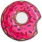
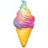
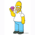
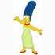
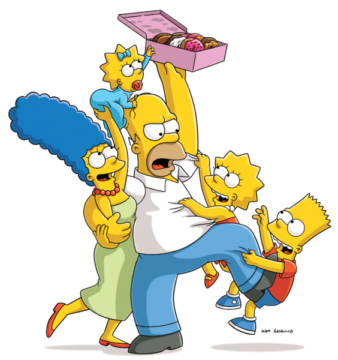
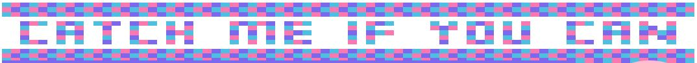

  
# 🏃 [CATCH ME IF YOU CAN GAME!](https://estishi87.github.io/CatchMeIfYouCan/)🏃‍♀ 

<!-- Donut PIC -->

    
  </a>

  
  

## Hello again! 👋  

#### 
I was inspired by the classic PacMan game and created my own map by changing the grid. I also designed all the characters and styled them in my own way.  

  ## 
 Gameplay 

Catch-Me-If-You-Can is an action maze chase video game; the player controls the character Lisa Marie Simpson  through an enclosed maze. The objective of the game is to eat all of the ice cream  and doughnuts  placed in the maze while avoiding four family members — Homer Jay Simpson (Dad) , Marjorie Jacqueline "Marge" Simpson (Mum) , Bartholomew Jay "Bart" Simpson (Brother) , and Margaret Evelyn Lenny "Maggie" Simpson (Baby Sister)  — that pursue Lisa. When Lisa eats all of the ice-cream and doughnuts, the player wins the game.

  <!-- Simpson family PIC -->

    
  </a>

I have styled an infinite moving grid on the top of the webpage to make it stylish. I used the same method to create the game board:

<!-- Moving Letters Pic -->

    
  </a>

## Things to improve:  

    
  </a> I would like to add arrows so that you can play this game on mobile phones!   

  </a> I wish to add a next level with a different map and maybe new characters after you win the first level :)  
  

Hope you like it! 🙌🏻

# Esti🎀 
<!-- PIC OF ME --> 

    
  
[My Web🌐](https://estishi87.github.io/EstiShi/)
 

