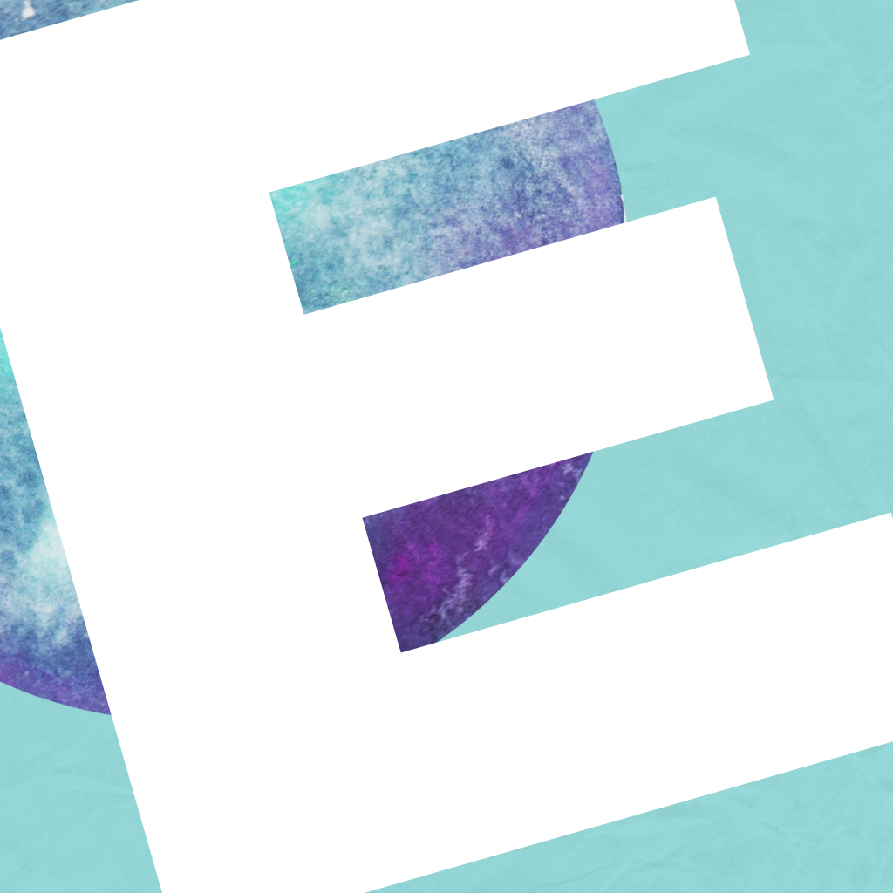
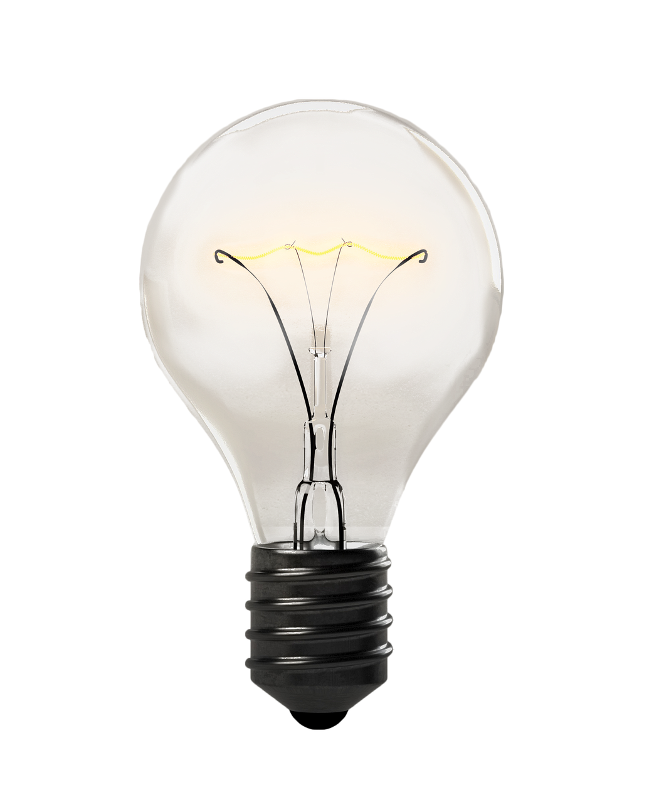
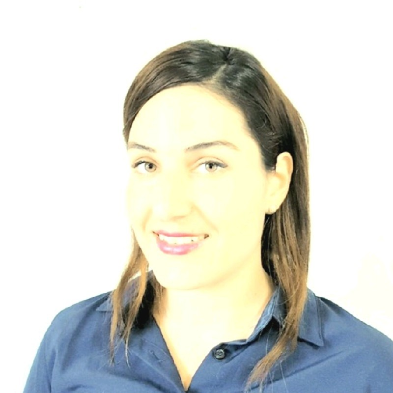

  
# 🌐[My Web Page](https://estishi87.github.io/EstiShi/)🌐
 

<!--MAIN PIC -->

    
  </a>

## Hello again! 👋  
## 
This web page created by me and inspired from many different tetorials and web development sites.  

 
  
###  
I created this project to apply for Founders and Coders Software Developer [Skills Bootcamp](https://www.foundersandcoders.com/learn/).  

  
  ## 
About
 

First I desined the main section itself and in the time I added the next sections.
I have showed this web to my friends and everytime I asked for feedback, someone gave me another idea😅, which made me improve this website. 
I've got to say that I really benefit from the FAC meet-ups, some of the mentors and coleuges helped me and gave me some more ideas which really helps!
  

 

I have tried to make this web as uniqe as possible and played around with some different functions I have leart on my progress.
  

## Things to improve:  

  
  </a> I need to add animation which makes the picture on section "About" to flip around and shows text behind it. Next level will be to add different text each time you turn it and then I can add some nice and fun facts about coding and more reletive things!   
  
  </a> Must have section of where I got insperation form   
    
  </a> I would like to add section: my journey through this!   

  </a> I wish to add section about my hobbies and add some pictures about Cachiball team trainings that I'm part of and also about Pilatis training I'm taking part. Both of this hobbies, I'm part of group of mums which would like to improve their health and I'm really proud of it :)   
  

Hope to manage to add all changes to the site! 🙌🏻

# Esti🎀 
<!-- PIC OF ME --> 

    
  
[My Web🌐](https://estishi87.github.io/EstiShi/)
 
