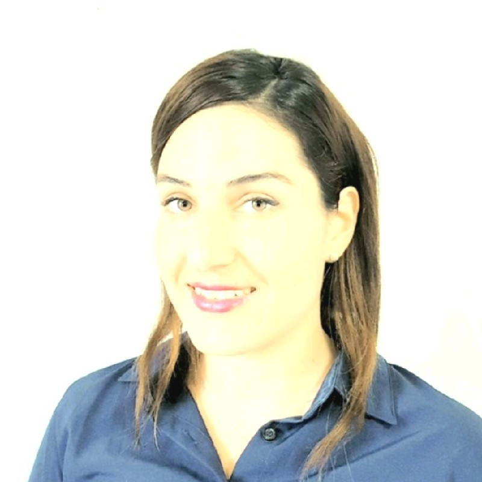

  
# 🌐[My Web Page](https://estishi87.github.io/EstiShi/)🌐
 

<!--MAIN PIC -->

    
  </a>

## Hello again! 👋  
## 
This web page created by me and inspired from many different tutorials and web development sites.  

 
  
###  
I created this project to apply for the Founders and Coders Software Developer [Skills Bootcamp](https://www.foundersandcoders.com/learn/).  

  
  ## 
About
 

First, I designed the main section itself and then added the next sections over time. I have shown this website to my friends and every time I asked for feedback, someone gave me another idea😅 which helped me improve this website. 
I have to say that I really benefited from the FAC meet-ups; some of the mentors and colleagues helped me and gave me some more ideas which really helped!
  

 

I have tried to make this website as unique as possible and played around with some different functions that I have learned during my progress.
  

## Things to improve:  

  
- I need to add a different text each time you turn the picture on the “About†section and then I can add some nice and fun facts about coding and more relevant things!   
 - A must-have section of where I got inspiration from!   
 - I would like to add a section about my journey through this!   
- I wish to add a section about my hobbies and add some pictures about Cachiball team trainings that I’m part of, and also about Pilates training that I’m taking part in. Both of these hobbies are part of a group of moms who would like to improve their health, and I’m really proud of it :)   
  

Hope to manage to add all changes to the site! 🙌🏻

# Esti🀠
<!-- PIC OF ME --> 

    
  
[My Web🌐](https://estishi87.github.io/EstiShi/)
 
