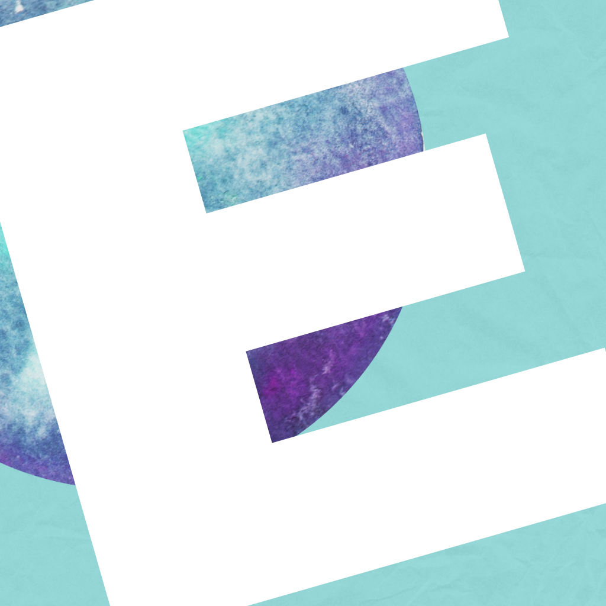

<!-- GITHUB ICON -->

  

## Hello! 👋 

#### I’m a beginner web developer and I would like to progress in this area to build up my set of skills and become a great web developer.  
I have always been interested in technology and how it can be used to solve problems💫. Thinking about programming, I find it really amazing that these written words can automate processes and change so many things that can make our lives easier! ⭐  
I was first introduced to coding when I was working on a project for my previous job as an accountant💻. I was tasked with creating a program that would automate some of the financial reporting processes🕵️‍♀️. I find the process of coding to be very rewarding and I enjoy the challenge of solving problems through code🔀.  
I have been exploring different coding languages and tools and have been working on various coding projects in my free time🧐. I find coding to be a great way to express my creativity and I enjoy the process of developing new applications🛠️.  
I am excited to continue learning more about coding and I am looking forward to applying my skills in a professional setting🏅🥉🥈🥇.  

<!-- FOLDER ICON --> 

    
  
## My projects: 

📂 [CatchMeIfYouCan](https://estishi87.github.io/CatchMeIfYouCan/) - **My game** is inspired from the old PacMan game. I designed a new look for the game with a fresh style and characters, have a look!🮠 
📂 [EstiShi](https://estishi87.github.io/) - **My webside**, which show all of my work and my proccess through this learing journey, designed my own style and a bit about myself   
📂 [TTT_Game](https://estishi87.github.io/TTT_Game/) - **ic** **ac** **oe** is my first game, which I love and it's simply fun! ❎🔴   
📂 [BabyShower](https://estishi87.github.io/BabyShower/) - an article about how to plan a **Baby shower** if you are interested 😅
This was my attempt to design and style a webpage 🎨  
📂 [SpriteAnimation](https://estishi87.github.io/SpriteAnimation/) - An **amazing animation** I have learnt from a toturial of Franks laboratory, which I inspire from and practicing to improve my JavaScript skills👩‍💻  

<!-- HEART ICON --> 

  

  <!-- ACKNOWLEDGMENTS --> 
##  Resources 

Here are some resources that I find helpful and would like to give credit to:
  
* [W3 Schools website](https://www.w3schools.com/) - I found this website the best for me. It shows live examples on site which was exactly what I needed. I think I used this side the most.
* [Google it! 😅](https://www.google.co.il/) - Really basic but I used Google a lot!
* [ChatGPT](https://chatgpt.ai/) - My new best friend! 👭
* [Code with Ania Kubów YouTube tutorials](https://www.youtube.com/@AniaKubow) - These really helped me to understand more about JavaScript.
* [Stack Overflow](https://stackoverflow.com/) - A really good community with good answers to your technical questions.
* [Pixabay](https://pixabay.com/) A great website for free quality photos.
* [unDraw](https://undraw.co/search) Open-source illustrations which I really like.
* [Boxicons](https://boxicons.com/?query=) High Quality Web Icons  

  
# 🌐[About my Web Page](https://estishi87.github.io/)🌐
 

<!--MAIN PIC -->

    
  </a>

## 
This web page was created by me and inspired by many different tutorials and web development sites.  

 
  
###  
I created this project to apply for the Founders and Coders Software Developer [Skills Bootcamp](https://www.foundersandcoders.com/learn/).  

  
  ## 
About
 

First, I designed the main section itself and then added the next sections over time. I have shown this website to my friends and every time I asked for feedback, someone gave me another idea😅 which helped me improve this website. 
I have to say that I really benefited from the FAC meet-ups; some of the mentors and colleagues helped me and gave me some more ideas which really helped!
  

 

I have tried to make this website as unique as possible and played around with some different functions that I have learned during my progress.
  

## Things to improve:  

  
- I need to add a different text each time you turn the picture on the “About†section and then I can add some nice and fun facts about coding and more relevant things!   
 - On resources section next level will be to make earth turn around!   
 - I would like to add a section about my journey through this!   
 - I wish to add a website about my hobbies and add some pictures about Cachiball team trainings that I’m part of, and also about Pilates training that I’m taking part in. Both of these hobbies are part of a group of moms who would like to improve their health, and I’m really proud of it! :)   
  

Hope to manage to add all changes to the site! 🙌🏻

# Esti🀠
<!-- PIC OF ME --> 

    
  
[My Web🌐](https://estishi87.github.io/)
 
